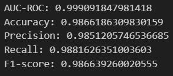
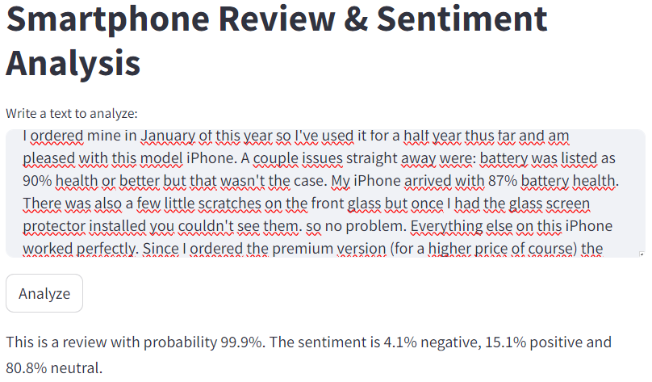

# NLP Smartphone Reviews

Performs topic modelling, classification based with a BERT model and deploys with a streamlit web application. Data was collected from this <a href="https://www.kaggle.com/datasets/kmldas/apple-iphone-se-reviews-ratings">Apple iPhone reviews dataset</a>, which contains iPhone reviews (in text), and their corresponding title and star-rating. A live website running the application can be accessed <a href="http://149.56.100.90:8501/">here</a>.

## 'topic-modelling-sentiment' notebook  
Exploratory analysis of frequently mentioned topics (battery, camera, etc...). Performs topic modelling (LDA model) and associates sentiment with each topic, showing them in a boxplot. Exports a dataset (parquet file) with processed reviews text.

## 'train_amazon_review_identification' notebook  
Uses the processed reviews generated by the topic-modelling-sentiment notebook to train and save a BERT model to identify whether a given text is an iPhone review or not. Metrics on the test set:    

  
## app.py
Streamlit script that creates a web page with a form to write text in, and a submit button. When submitted, it uses the model trained in the 'train_amazon_review_identification' notebook to identify whether or not it is a smartphone review, and output the sentiment associated with the text (negative, neutral or positive).

